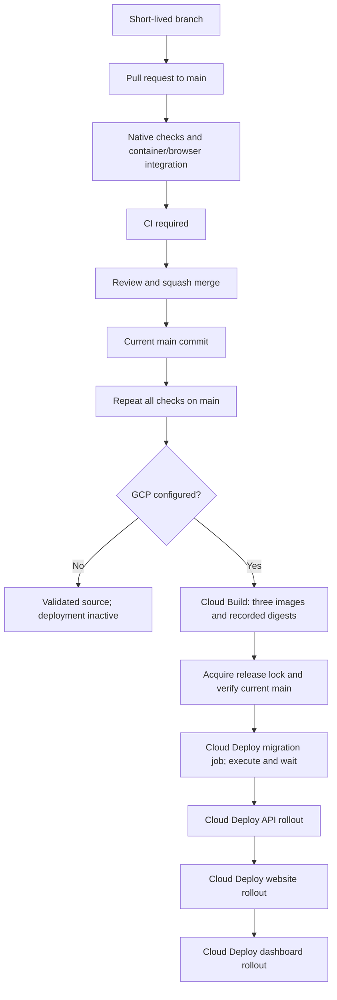

# GitHub Flow and CI/CD

The repository uses short-lived branches and pull requests into `main`, followed by a validated release of that exact commit. [CONTRIBUTING.md](../CONTRIBUTING.md) defines the developer workflow. The executable workflow is [ci.yml](../.github/workflows/ci.yml); cloud prerequisites and recovery are in [infra/README.md](../infra/README.md).



## Continuous integration

Pull requests targeting `main`, pushes to `main` and manual workflow runs execute the validation jobs. The whole workflow runs for documentation changes too, so required checks cannot be left pending by path filters. PR runs have read-only repository permissions and no cloud identity. A new PR run can cancel an obsolete PR run; main releases are serialized and never canceled by a newer push.

| Job/check | Required result |
| --- | --- |
| `checks` | Python release/policy regressions; shell syntax; Rust fmt, Clippy and unit tests; PostgreSQL API integration; strict TS/lint for both apps and test tooling; frontend production builds; Compose configuration; Terraform format, locked provider initialization and validation |
| `integration` | Build/start all Compose services; HTTP smoke suite; Playwright CMS/public-site/schema tests; retain diagnostic artifacts |
| `CI required` | Always evaluate both validation results; fail if either failed, was skipped or canceled |
| `build` | Trusted current `main` only, after `CI required`, with cloud activation configured; build and record immutable images |
| `deploy` | Use the successful build artifact, verify commit provenance/current `main`, then execute the ordered Cloud Deploy release |

`CI required` is the exact required-check context in the ruleset. The GitHub Actions integration is pinned as its status provider. Action dependencies are pinned to full commit SHAs; keep the version comments updated when upgrading. Workflow logs and retained artifacts provide diagnostics, but passing local checks is not evidence of a successful hosted run.

## Continuous delivery

Deployment activates only when the repository-level `GCP_PROJECT_ID` is configured. Complete the rest of the cloud inputs first. Until then, all PR/main validation remains active and build/deploy are intentionally skipped. No GCP project ID is guessed.

The `production` environment must allow only the `main` branch. The current single-owner policy releases automatically after reviewed merge and passing CI; required environment reviewers can be added when an independent release approver is available. Production deployment is not a pre-merge requirement, since it runs after merging.

GitHub authenticates with Workload Identity Federation. GCP trust restricts repository/owner IDs, repository name, `main`, the `production` environment, `.github/workflows/ci.yml` and push/manual events. No service-account key is stored in GitHub. Terraform setup is separate from application releases.

Cloud Build produces the API, website and dashboard images. Release records retain the full commit SHA and image digests. The migration job uses the API digest; the release waits for actual migration execution, not merely job creation, before rolling out the API, website and dashboard. All applications must remain compatible with the previous schema/revisions during this sequence. Rollouts are ordered and can partially succeed; they are not one atomic transaction.

A conditional GCS lock prevents overlapping releases. The scripts verify the checked-out SHA and current remote `main` before build/release; an old workflow rerun cannot silently redeploy a superseded commit. Failed active releases retain recovery evidence and require inspection before clearing the lock. Reverting application code should normally be a new PR to `main`; emergency rollback uses the documented Cloud Deploy recovery procedure without reversing database migrations.

To retry the current main release, run the existing workflow and its checks:

```sh
gh workflow run ci.yml --repo skytekno/holding-website --ref main
```

Application deployment through `scripts/deploy.sh deploy` or the release module is restricted to the trusted workflow. Local `bootstrap`, `database`, `routing` and `outputs` commands remain available for the separately documented setup. See [cloud setup and variables](../infra/README.md#github-configuration) for the complete activation inputs, pinned Secret Manager versions, external PostgreSQL TLS and fixed outbound IP.

## Activate GitHub policy

The importable [main ruleset](../.github/rulesets/main.json) requires PRs, current-base `CI required`, resolved review threads and linear history. It blocks force pushes/deletion and grants no bypass actors. [Repository settings](../.github/repository-settings.json) allow squash merges and delete merged branches. Zero required peer approvals accommodates the single known owner; a second maintainer enables the stronger review settings described in CONTRIBUTING.

GitHub must have an initial published `main` branch and the workflow before full PR development can start. The one-time foundation publication is tracked in MAN-57. Run its first hosted validation, then install protection before normal development. Rulesets for a private organization repository require an eligible GitHub plan and repository administration permission.

```sh
# Authenticate gh with an identity permitted to administer this repository.
# Read-only comparison; nonzero exit means inaccessible or not matching.
python3 scripts/configure_github.py
# After reviewing both JSON policies, apply and verify them.
python3 scripts/configure_github.py --apply
```

The script backs up the managed merge settings and existing named ruleset under `.artifacts/` with owner-only permissions before writing. It only updates the rule named `GitHub Flow - main`, preserves unrelated rulesets, and does not publish source, modify credentials, or provision cloud resources. It refuses to remove existing extra rules/checks, reduce peer-review requirements or change branch scope; reconcile those differences first. Reapplying a matching policy makes no writes. Changes to the rule and merge settings are separate API operations; if one fails, inspect live state and the printed backup before retrying.

Set up the `production` environment separately in GitHub Settings → Environments with selected branch `main` only; preserve any existing reviewers/wait rules. Configure the variables from infra/README only after GCP bootstrap. Verify an ordinary direct push is rejected and a PR cannot merge with failing checks, then record the run URLs in MAN-58.

The initial foundation is tracked in MAN-57. Because the remote repository started empty, an empty bootstrap commit establishes `main` as the pull-request base; the complete application is reviewed on `chore/man-57-foundation`. Publishing the bootstrap does not run an application workflow. Use the PR's exact commit and hosted checks as review evidence before merging. Repository policy activation and production deployment remain separate gates.

Local verification passed on 27 September 2026: 22 Python release/policy tests, Rust formatting/Clippy and 21 unit tests, the PostgreSQL integration test, strict lint/type checking, both frontend production builds, Compose builds/health checks, the smoke suite, 9 Playwright browser/contract tests and all three Terraform roots with Terraform 1.16.4. Actionlint 1.7.12, shell syntax and Python compilation also passed. Cloud interactions in release unit tests are mocked; they do not provision resources. The known editor session-expiry draft-loss issue remains tracked in MAN-65; real Google sign-in, external PostgreSQL TLS, GCS/CDN behavior and cloud deployment still require hosted acceptance.

References: [GitHub Flow](https://docs.github.com/en/get-started/using-github/github-flow), [ruleset API](https://docs.github.com/en/rest/repos/rules), [ruleset availability](https://docs.github.com/en/repositories/configuring-branches-and-merges-in-your-repository/managing-rulesets/creating-rulesets-for-a-repository), [Cloud Deploy Cloud Run targets](https://docs.cloud.google.com/deploy/docs/run-targets).
